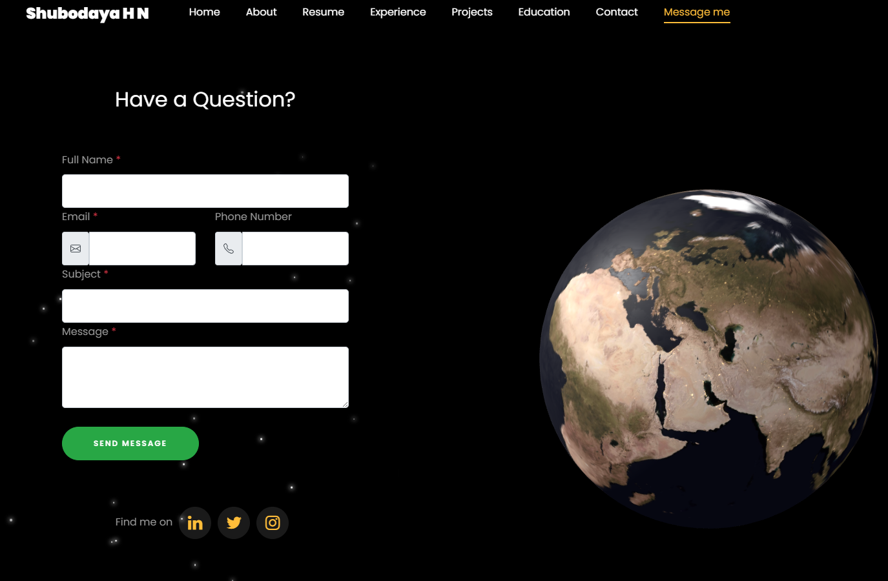
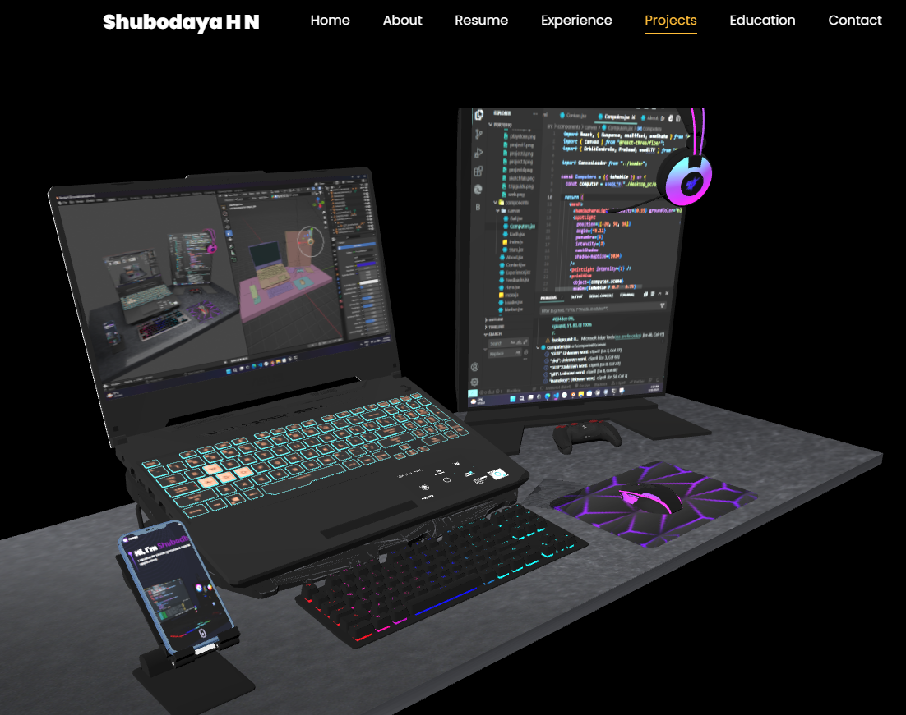

# Porfolio
My portfolio website link
https://shubodaya.github.io/3D-Porfolio/

# 🌌 Shubodaya's Interactive 3D Portfolio Website

Welcome to my personal portfolio! This is not your average portfolio — it's a visually rich, immersive experience showcasing my passion for design, development, and digital creativity. Built with 3D models, animations, and a modern UI, this site blends aesthetic appeal with functionality.

---

## 🚀 Features

- 🎮 **Interactive 3D Models**: Includes gaming setup and Earth models designed in **Blender** and integrated with **Three.js**.
- 🌠 **Starry Night Background**: Cosmic-inspired aesthetic using animated particles for a unique vibe.
- 🧠 **"About Me" Timeline**: Clean vertical timeline layout to narrate my journey.
- 💬 **Contact Section**: Web3Forms-powered secure and spam-free form.
- 📱 **Fully Responsive**: Optimized for all devices using Bootstrap.
- 🌐 **Social Links**: Easily find me on LinkedIn, Instagram, and Twitter.
- 📄 **Resume Download**: One-click resume download button.
- ⚙️ **Modern Animations**: Scroll-based and hover animations with AOS & Animate.css.

---

## 🛠️ Tech Stack

| Frontend     | Tools / Libraries           |
|--------------|-----------------------------|
| HTML5        | Semantic, Clean Markup      |
| CSS3 / SCSS  | Custom styling, animations  |
| JavaScript   | Dynamic interactions        |
| Bootstrap 5  | Responsive grid and layout  |
| Three.js     | 3D model rendering          |
| Web3Forms    | Contact form submission     |
| Blender      | 3D model creation           |
| AOS          | Scroll animations           |
| FontAwesome / IcoMoon | Icons and symbols |

---

## 📸 Screenshots

<details>
<summary>💻 Click to Expand</summary>

| 3D Earth | Gaming Setup |
|---------|--------------|
|  |  |

</details>

---

## 📂 Folder Structure

```bash
project/
├── index.html
├── js/
│   ├── main.js
│   ├── model.js
├── css/
│   ├── style.css
│   ├── animations.css
├── models/
│   ├── earth.glb
│   ├── gaming_setup.glb
├── assets/
│   ├── images/
│   ├── fonts/
├── screenshots/
│   ├── earth.png
│   ├── setup.png
